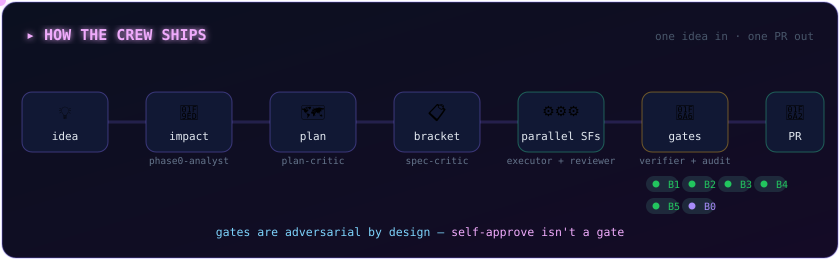
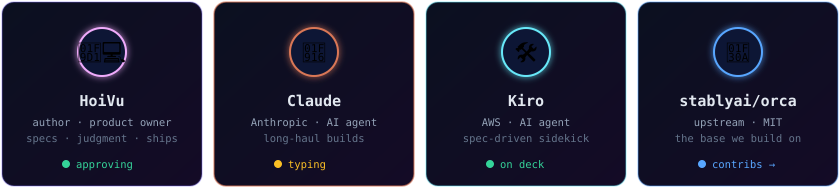

<div align="center">
  
</div>

<p align="center">
  <a href="https://wakii.dev"></a>
  
  
  
  
</p>

<p align="center">
  <a href="https://wakii.dev"><b>Website</b></a> ·
  <a href="https://wakii.dev/docs/getting-started/">Docs</a> ·
  <a href="https://wakii.dev/skills/">Skills</a> ·
  <a href="https://wakii.dev/roadmap/">Roadmap</a> ·
  <a href="https://github.com/wakii-dev/wakii/releases">Download</a> ·
  <a href="https://github.com/stablyai/orca">Upstream: stablyai/orca</a>
</p>

---

Wakii is a fork of [Orca](https://github.com/stablyai/orca) (MIT) — the AI
orchestrator that runs Codex, Claude Code, OpenCode, Pi and **any other CLI
agent** side-by-side, each in its own isolated git worktree.

On top of that base, Wakii ships a complete **agentic workflow kit** that
installs itself on first run — no setup, enabled by default.

## 🖼️ The product

<table>
<tr>
<td width="50%"><p align="center"><sub><b>Landing</b> — wakii.dev</sub></p></td>
<td width="50%"><p align="center"><sub><b>Skills catalog</b> — cell by cell</sub></p></td>
</tr>
</table>

## ⚙️ How the crew ships

<div align="center">
  
</div>

**One specialist per stage — and the checker is never the builder.** The
impact-analyst maps the blast radius before code exists; the spec-critic and
plan-critic attack the spec and the task DAG; task-executors implement
independent sub-features in parallel worktrees; the code-reviewer and
verifier hold the gates (self-reports don't count); the watchdog auto-resumes
anything that stalls.

<details>
<summary><b>The gates (B0–B5) &amp; verdicts</b></summary>

| Gate | Checks |
| ---- | ------ |
| **B0** | Browser test — the agent actually opened the app and walked the flow |
| **B1** | Code + tests pass |
| **B2** | Plan checkboxes ticked |
| **B3** | Independent review done |
| **B4** | Branch merged to the story branch |
| **B5** | Linear issue set to Done |

Verifier verdicts: `COMPLETE` · `READY-TO-DONE` · `INCOMPLETE` ·
`VIOLATION` · `NOT-LAUNCHED`.

</details>

## 🧠 How skills work

Skills are **packaged instruction sets** loaded on demand — progressive
disclosure instead of a bloated system prompt: name and one-line description
stay cheap in context; the **full instructions load only when your task
matches**. Skills compose — the story workflow is itself built from the
planning and review skills below.

<div align="center">
  
</div>

<details>
<summary><b>Full catalog — command, what it does, how it works</b></summary>

**Workflow — the idea-to-PR spine**

| Command | What it does | How it works |
| ------- | ------------ | ------------ |
| `/brainstorm` | Turns a rough idea into a validated spec + implementation plan | Explores intent through clarifying questions, challenges assumptions, then produces the spec — optionally publishing the plan to Linear and isolating a worktree |
| `/writing-plans-linear` | Plans detailed enough for an engineer with zero context | Decomposes the spec into bite-sized tasks (files, code, how to test) and publishes to Linear for team visibility |
| `/story-workflow` | Runs large features as epic + sub-feature brackets | Analyzes once at epic level, writes a bracket file with dependencies, launches each sub-feature as an isolated workflow |
| `/orca-superpowers-workflow` | The end-to-end pipeline in one command | Impact analysis → Linear issue → spec → plan → task DAG → gated execution → verification, auto-activating the Orca bridges at every transition |

**Design — from brief to shipped UI**

| Command | What it does | How it works |
| ------- | ------------ | ------------ |
| `/frontend-design` | UI that reads as intentional, never templated | Approaches each brief like a design lead — grounds the design in the subject before writing a line |
| `/gpt-taste` | Breaks the statistical biases of AI-generated design | Enforces layout randomization, AIDA structure, editorial typography, gapless bento grids, strict GSAP ScrollTriggers |
| `/design-taste-frontend` | Anti-slop review of UI that is already built | Audit-first pass: reads the brief, infers intent, checks the built UI against taste rules contextually |
| `/image-to-code` | One reference image → a real component | Reads the image like an art director (hierarchy, spacing, tokens), then produces code against it as a fidelity target |
| `/mock-prototype` | Three HTML design directions to pick from | Drafts 3 directions, hosts each on an unlisted link, waits for your pick, polishes the chosen one |
| `/web-design-guidelines` | 105 concrete web interface rules, enforced in code | Heuristic engine (vendored from vercel-labs, MIT) covering accessibility, focus, forms, animation, layout |

**Reference & tooling**

| Command | What it does | How it works |
| ------- | ------------ | ------------ |
| `/figma-orientation` | Routes any Figma task to the right skill or MCP call | Loads first on Figma work, reads what you actually want, then routes — before you guess wrong |
| `/graph-engineering` | Knowledge graphs + agent orchestration, taught with examples | Ontology design, entity extraction, GraphRAG, parallel fan-out, verifier separation, the stop rule |
| `/prompt-master` | One production-ready prompt for the tool you name | Extracts real intent, identifies the target tool, outputs a single optimized prompt with zero wasted tokens |

</details>

## ⚡ What the kit adds on top of Orca

| ✨ | Highlight |
| -- | --------- |
| 🤖 | **9-agent story team** — adversarial specialists with checks-and-balances; self-approval never counts as a gate |
| 🧠 | **20 bundled skills** — planning, review, design pipelines, machine-control platform skills |
| 🛠️ | **24 `story-*` CLIs** — gate checks, stall watchdog, preflight, story tests |
| 🎨 | **HoiVu branding** — rebranded UI, fork-local full plugin access |

## 🔀 Inherited from Orca (kept intact)

<details>
<summary><b>Feature wall</b></summary>

- **Parallel worktrees** — fan one prompt across agents, merge the winner
- **Terminal splits** — every agent gets a real terminal
- **GitHub & Linear, native** — issues, PRs and story tracking built in
- **SSH worktrees · design mode · AI-diff annotation · drag-files-to-agents**
- **Mobile companion** — steer agents from your phone

Full wall with screenshots:
[upstream README](https://github.com/stablyai/orca#features).

</details>

## 🌿 Branches

| Branch      | Purpose                                                                 |
| ----------- | ----------------------------------------------------------------------- |
| `wakii-dev` | **default — Wakii development happens here**                            |
| `main`      | mirrors `stablyai/orca` main, auto-synced daily by GitHub Action        |

## 📦 Download

macOS builds ship on [GitHub Releases](https://github.com/wakii-dev/wakii/releases)
— unsigned, so right-click → **Open** on first launch (or allow it in
System Settings → Privacy & Security):

| Machine       | Asset                                                                                                                            |
| ------------- | -------------------------------------------------------------------------------------------------------------------------------- |
| Apple Silicon | [Wakii-1.4.199-arm64.dmg](https://github.com/wakii-dev/wakii/releases/download/v1.4.199/Wakii-1.4.199-arm64.dmg)                  |
| Intel         | [Wakii-1.4.199-x64.dmg](https://github.com/wakii-dev/wakii/releases/download/v1.4.199/Wakii-1.4.199-x64.dmg)                      |
| Android       | [app-release.apk](https://github.com/wakii-dev/wakii/releases/download/mobile-android-v0.0.48/app-release.apk)                    |
| Windows       | [orca-windows-setup.exe](https://github.com/wakii-dev/wakii/releases/download/v1.4.199/orca-windows-setup.exe)                     |

Build from source ([guide](#-developing)) works everywhere.

## 🚀 Developing

```bash
pnpm install
pnpm dev        # desktop dev build
```

Full guide: [.github/CONTRIBUTING.md](.github/CONTRIBUTING.md). The
mobile↔desktop relay lives in [`cloud/`](cloud/README.md) with its own setup
guide.

## 📄 License

MIT — same as upstream Orca. The bundled story-team kit originates from
[superpowers](https://github.com/obra/superpowers) (MIT) by Jesse Vincent.

## 👥 Contributors

<div align="center">
  
</div>
